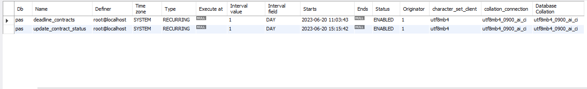
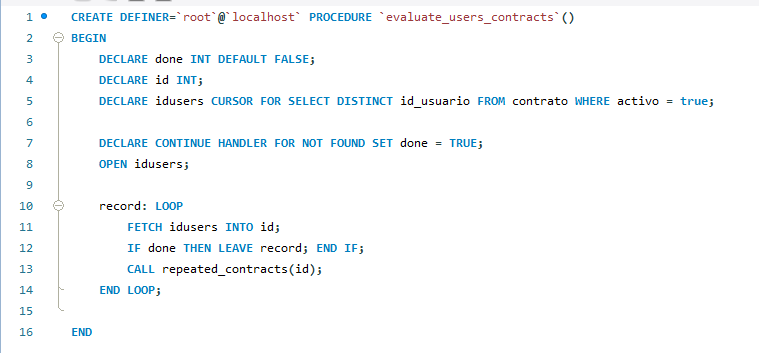
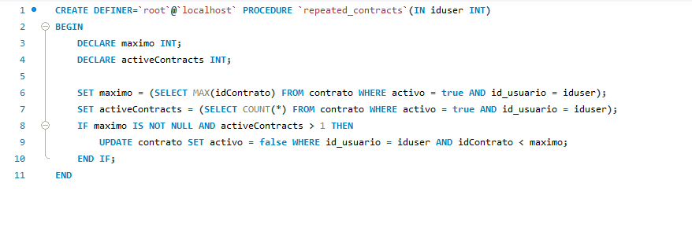
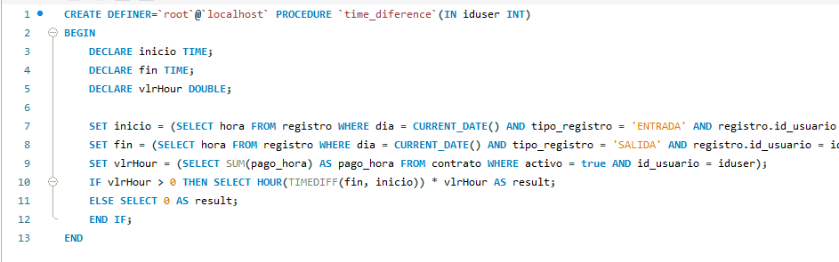
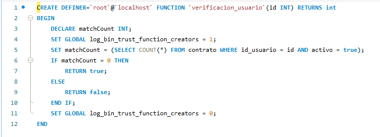

# Proyecto de Aula Semestral
## **Cambios añadidos el día 20 de Junio del 2023**
Se ha creado la nueva base de datos cuyo diagrama es basado en el diagrama E-R presentado a continuación.

Además de esto, se ha agregado inicialmente dos eventos que corren diariamente verificando tanto los contratos que han sido repetidos (para evitar que el empleado tenga más de 1 contrato) y el de la diferencia de tiempo que hay entre la hora de entrada y salida. Dichos eventos tienen los detalles que se muestran a continuación.

**Procedures Creados**

Los procedures que han sido creados son específicamente para los diferentes eventos que se han puesto anteriormente. Serán listados a continuación.

* evaluate_users_contracts()
  - Este procedimiento almacenado tiene como objetivo tomar en cuenta todos los usuarios que presentan contratos activos actualmente.

  

* repeated_contracts(IN iduser INT)
    - Este procedimiento tiene como objetivo evaluar si un usuario ya tiene un contrato activo con la empresa. En caso de ser así, cancelará dicho contrato para mantener solo un contrato activo.

    

* time_difference(IN iduser INT)
    - Este stored procedure es usado para definir la diferencia de tiempo que tiene un usuario en el día actual. Actualmente su uso es para un evento que va a ser ejecutado diariamente para insertar una nueva consignación del empleado.

    

**Funciones**
Las funciones creadas por el momento son las siguientes.

* verificacion_usuario(id INT)
    - Cuenta los contratos activos del usuario y, en caso que se encuentre alguno, esta función devuelve un valor verdadero. En caso contrario, se retorna un valor falso.

    

> Escrito por Agustín Hernández. 20 de Junio del 2023.